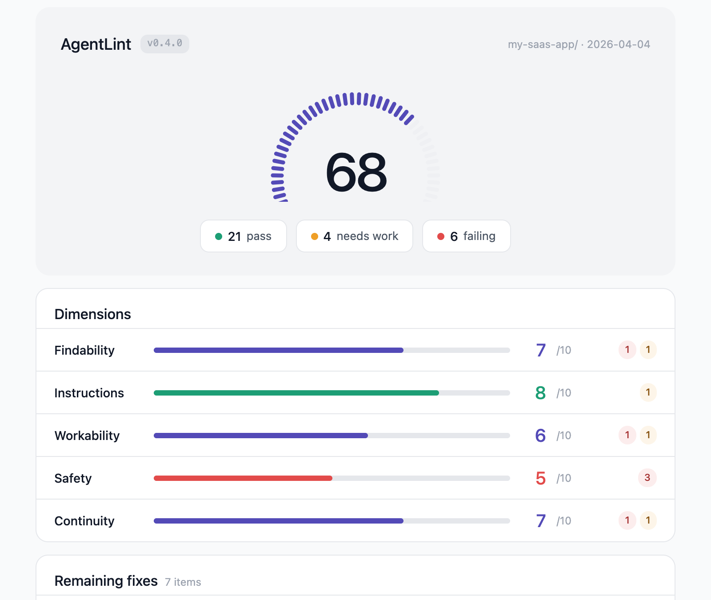

<p align="center">
  
</p>

<h1 align="center">AgentLint</h1>

<p align="center">
  <strong>Your AI agent is only as good as your repo.</strong><br>
  49 checks. 8 dimensions. Works across Claude Code, Codex, Cursor, Copilot, Gemini, Windsurf, Cline.
</p>

<p align="center">
  <a href="https://github.com/0xmariowu/agent-lint/actions/workflows/ci.yml"></a>
  <a href="https://github.com/0xmariowu/agent-lint/releases"></a>
  <a href="https://opensource.org/licenses/MIT"></a>
  <a href="#what-it-checks"></a>
</p>

<p align="center">
  <a href="https://docs.agentlint.app">Docs</a> &middot;
  <a href="#what-it-checks">Checks</a> &middot;
  <a href="#how-scoring-works">Scoring</a> &middot;
  <a href="#evidence">Evidence</a> &middot;
  <a href="CONTRIBUTING.md">Contributing</a>
</p>

---

AgentLint finds what's broken — file structure, instruction quality, build setup, session continuity, security posture — and fixes it.

> We analyzed 265 versions of Anthropic's Claude Code system prompt, documented the hard limits, audited thousands of real repos, and reviewed the academic research. The result: a single command that tells you exactly what your AI agent is struggling with and why.

## Install

```bash
npm install -g @0xmariowu/agent-lint
```

Then start a new Claude Code session:

```
/al
```

That's it. AgentLint scans your projects, scores them, shows what's wrong, and fixes what it can.

### Platform requirements

AgentLint's scanner is a bash script, so the host needs a POSIX shell:

| Platform | Requirement |
|----------|-------------|
| macOS | Works out of the box (system bash). |
| Linux | Works out of the box. `jq` and `git` must be on `PATH`. |
| Windows | Requires **Git Bash** (from [Git for Windows](https://git-scm.com/download/win)) or **WSL** ([install guide](https://learn.microsoft.com/windows/wsl/install)). Run `npm install -g @0xmariowu/agent-lint` from inside the bash shell. A pure `cmd.exe` / PowerShell install will exit with a guidance message pointing to one of the two options above. |

Node.js 20+ is required on every platform.

## Supported AI coding agents

AgentLint auto-detects the entry file for major AI coding agents. Claude-specific checks skip gracefully for other platforms so they aren't penalized unfairly.

| Agent | Entry file | Notes |
|-------|-----------|-------|
| Claude Code | `CLAUDE.md` | Full check coverage including F7 @include and C5 CLAUDE.local.md |
| OpenAI Codex / Agents | `AGENTS.md` | Core checks apply |
| Cursor | `.cursorrules` or `.cursor/rules/*.mdc` | Core checks apply |
| GitHub Copilot | `.github/copilot-instructions.md` | Core checks apply |
| Google Gemini CLI | `GEMINI.md` | Core checks apply |
| Windsurf | `.windsurfrules` | Core checks apply |
| Cline | `.clinerules` | Core checks apply |

If multiple entry files exist, priority order is CLAUDE.md → AGENTS.md → .cursorrules → copilot-instructions.md → GEMINI.md → .windsurfrules → .clinerules → .cursor/rules/*.mdc. The winning file is reported in F1's measured_value along with all detected files.

## GitHub Action

Add AgentLint to your CI in three lines:

```yaml
- uses: 0xmariowu/agent-lint@v0
  with:
    fail-below: '60'  # optional: fail the build if score drops below 60
```

### SARIF integration

To get AgentLint findings in your repo's **Security tab** and as **inline PR annotations**, enable SARIF upload:

```yaml
permissions:
  contents: read
  security-events: write  # required for SARIF upload

steps:
  - uses: 0xmariowu/agent-lint@v0
    with:
      sarif-upload: 'true'
```

> **Note:** SARIF upload requires Code scanning enabled (free for public repos, GHAS for private). Inline PR annotations via `::warning` commands work on all repos regardless.

**Inputs:**
- `project-dir` — directory to scan (default: repo root)
- `fail-below` — minimum score 0-100 (default: 0 = never fail)
- `format` — `terminal`, `md`, `jsonl`, `html`, or `all` (default: `terminal`)
- `output-dir` — where to write reports (required for non-terminal formats)

**Outputs:** `score` (0-100), plus per-dimension scores (`findability`, `instructions`, `workability`, `continuity`, `safety`, `harness`), each 0-10.

**Example: block PRs that regress AI-friendliness**

```yaml
name: AI-friendliness check
on: [pull_request]
jobs:
  agentlint:
    runs-on: ubuntu-latest
    steps:
      - uses: actions/checkout@v5
      - uses: 0xmariowu/agent-lint@v0
        with:
          fail-below: '50'
```

## What you get

```
$ /al

AgentLint — Score: 68/100

Findability      ██████████████░░░░░░  7/10
Instructions     ████████████████░░░░  8/10
Workability      ████████████░░░░░░░░  6/10
Safety           ██████████░░░░░░░░░░  5/10
Continuity       ██████████████░░░░░░  7/10
Harness          ██████████████████░░  9/10

Fix Plan (7 items):
  [guided]   Pin 8 GitHub Actions to SHA (supply chain risk)
  [guided]   Add .env to .gitignore (AI exposes secrets)
  [assisted] Generate HANDOFF.md
  [guided]   Reduce IMPORTANT keywords (7 found, Anthropic uses 4)

Select items → AgentLint fixes → re-scores → saves HTML report
```

The HTML report shows a segmented gauge, expandable dimension breakdowns with per-check detail, and a prioritized issues list. Before/after comparison when fixes are applied.

<p align="center">
  
</p>

## Why this matters

AI coding agents read your repo structure, docs, CI config, and handoff notes. They `git push`, trigger pipelines, and write files. A well-structured repo gets dramatically better AI output. A poorly structured one wastes tokens, ignores rules, repeats mistakes, and may expose secrets.

AgentLint is built on data most developers never see:

- **265 versions** of Anthropic's Claude Code system prompt — every word added, deleted, and rewritten
- **Claude Code internals** — hard limits (40K char max, 256KB file read limit, pre-commit hook behavior) that silently break your setup
- **Production security audits** across open-source codebases — the gaps AI agents walk into
- **4,533-repo corpus analysis** — hook/permission anti-patterns across 739 hooks and 1,562 settings.json files
- **6 academic papers** on instruction-following, context files, and documentation decay

## What it checks

### Findability — can AI find what it needs?

| Check | What | Why |
|-------|------|-----|
| F1 | Entry file exists | No entry file (CLAUDE.md / AGENTS.md / .cursorrules / copilot-instructions.md / etc.) = AI starts blind |
| F2 | Project description in first 10 lines | AI needs context before rules |
| F3 | Conditional loading guidance | "If working on X, read Y" prevents context bloat |
| F4 | Large directories have INDEX | >10 files without index = AI reads everything |
| F5 | All references resolve | Broken links waste tokens on dead-end reads |
| F6 | Standard file naming | README.md, CLAUDE.md are auto-discovered |
| F7 | @include directives resolve | Missing targets are silently ignored — skipped for non-Claude repos |
| F8 | Rule files use `globs:` frontmatter | `.claude/rules/*.md` should use `globs:`, not `paths:` — paths silently skips the rule |
| F9 | No unfilled template placeholders | `[your project name]`, `<framework>`, `TODO:` mean the CLAUDE.md was never finished |

### Instructions — are your rules well-written?

| Check | What | Why |
|-------|------|-----|
| I1 | Emphasis keyword count | Anthropic cut IMPORTANT from 12 to 4 across 265 versions |
| I2 | Keyword density | More emphasis = less compliance. Anthropic: 7.5 → 1.4 per 1K words |
| I3 | Rule specificity | "Don't X. Instead Y. Because Z." — Anthropic's golden formula |
| I4 | Action-oriented headings | Anthropic deleted all "You are a..." identity sections |
| I5 | No identity language | "Follow conventions" removed — model already does this |
| I6 | Entry file length | 60-120 lines is the sweet spot. Longer dilutes priority |
| I7 | Under 40,000 characters | Claude Code hard limit. Above this, your file is truncated |
| I8 | Total injected content within budget | CLAUDE.md + AGENTS.md + rules/*.md together, 60-200 non-empty lines is the sweet spot |

### Workability — can AI build and test?

| Check | What | Why |
|-------|------|-----|
| W1 | Build/test commands documented | AI can't guess your test runner |
| W2 | CI exists | Rules without enforcement are suggestions |
| W3 | Tests exist (not empty shell) | A CI that runs pytest with 0 test files always "passes" |
| W4 | Linter configured | Mechanical formatting frees AI from guessing style |
| W5 | No files over 256 KB | Claude Code cannot read them — hard error |
| W6 | Pre-commit hooks are fast | Claude Code never uses --no-verify. Slow hooks = stuck commits |

### Continuity — can next session pick up?

| Check | What | Why |
|-------|------|-----|
| C1 | Document freshness | Stale instructions are worse than no instructions |
| C2 | Handoff file exists | Without it, every session starts from zero |
| C3 | Changelog has "why" | "Updated INDEX" says nothing. "Fixed broken path" says everything |
| C4 | Plans in repo | Plans in Jira don't exist for AI |
| C5 | CLAUDE.local.md not in git | Private per-user file. Claude Code requires .gitignore |

### Safety — is AI working securely?

| Check | What | Why |
|-------|------|-----|
| S1 | .env in .gitignore | AI's Glob tool ignores .gitignore by default — secrets are visible |
| S2 | Actions SHA pinned | AI push triggers CI. Floating tags = supply chain attack vector |
| S3 | Secret scanning configured | AI won't self-check for accidentally written API keys |
| S4 | SECURITY.md exists | AI needs security context for sensitive code decisions |
| S5 | Workflow permissions minimized | AI-triggered workflows shouldn't have write access by default |
| S6 | No hardcoded secrets | Detects `sk-`, `ghp_`, `AKIA`, private key patterns in source |
| S7 | No personal paths | `/Users/xxx/` in source = AI copies and spreads the leak |
| S8 | No pull_request_target | AI pushes trigger CI. Elevated permissions = attack vector |

### Harness — are your Claude Code hooks and permissions correct?

These checks run against `.claude/settings.json`. Repos without that file score 1.0 on all H checks (no config = no issues), so Harness only affects repos that actively configured hooks or permissions. Evidence from analysis of 4,533 real Claude Code repos.

| Check | What | Why |
|-------|------|-----|
| H1 | Hook event names valid | Typos like `preCommit`, `sessionStart`, `postEditHook` silently never fire — users think they have protection but don't |
| H2 | PreToolUse hooks have `matcher` | 91% of corpus hooks lack matcher, firing on every Read/Grep/Glob — massive perf tax |
| H3 | Stop hook has circuit breaker | Stop hook exit non-zero → Claude continues → triggers Stop again → infinite loop. Only 5/92 corpus Stop hooks guard against this |
| H4 | No dangerous auto-approve | Bare `Bash(*)`, `*`, `mcp__*`, `sudo`, `rm -rf`, `git push --force` in `permissions.allow` = giving the agent root shell |
| H5 | `.env` deny covers variants | Denying `.env` without `.env.local`, `.env.production` etc. leaves the most sensitive variants readable |
| H6 | Hook scripts network access | Detects `curl`/`wget`/`fetch` in hook scripts — tool I/O could be exfiltrated to external servers |

### Optional: AI Deep Analysis

Spawns AI subagents to find what mechanical checks can't:
- Contradictory rules that confuse the model
- Dead-weight rules the model would follow without being told
- Vague rules without decision boundaries

### Optional: Session Analysis

Reads your Claude Code session logs to find:
- Instructions you repeat across sessions (should be in CLAUDE.md)
- Rules AI keeps ignoring (need rewriting)
- Friction hotspots by project

## How scoring works

Each check produces a 0-1 score, weighted by dimension, scaled to 100.

| Dimension | Weight | Why? |
|-----------|--------|------|
| Instructions | 25% | Unique value. No other tool checks CLAUDE.md quality |
| Findability | 20% | AI can't follow rules it can't find |
| Workability | 18% | Can AI actually run your code? |
| Safety | 15% | Is AI working without exposing secrets or triggering vulnerabilities? |
| Continuity | 12% | Does knowledge survive across sessions? |
| Harness | 10% | Are your Claude Code hooks/permissions actually configured correctly? |

Scores are measurements, not judgments. Reference values come from Anthropic's own data. You decide what to fix.

## Update

```bash
claude plugin update agent-lint@agent-lint
```

## Evidence

Every check cites its source. Full citations in [`standards/evidence.json`](standards/evidence.json).

| Source | Type |
|--------|------|
| [Anthropic 265 versions](https://cchistory.mariozechner.at) | Primary dataset |
| [corpus-4533](standards/evidence.json) analysis of 4,533 Claude Code repos | First-party data |
| Claude Code internals | Hard limits and observed behavior |
| [IFScale](https://arxiv.org/abs/2507.11538) (NeurIPS) | Instruction compliance at scale |
| [ETH Zurich](https://arxiv.org/abs/2602.11988) | Do context files help coding agents? |
| [Codified Context](https://arxiv.org/abs/2602.20478) | Stale content as #1 failure mode |
| [Agent READMEs](https://arxiv.org/abs/2511.12884) | Concrete vs abstract effectiveness |

## Requirements

- [Claude Code](https://claude.com/download)
- `jq` and `node` 20+

## License

MIT
